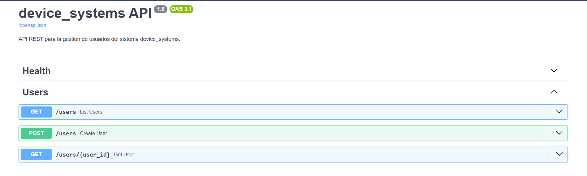
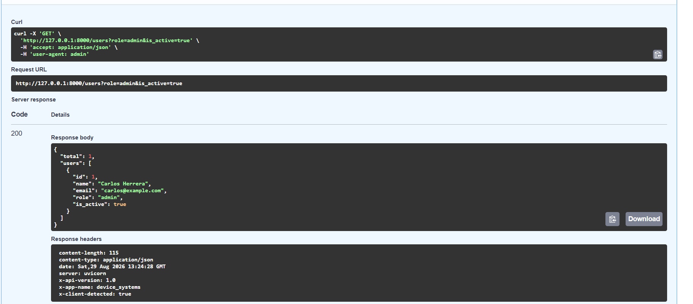
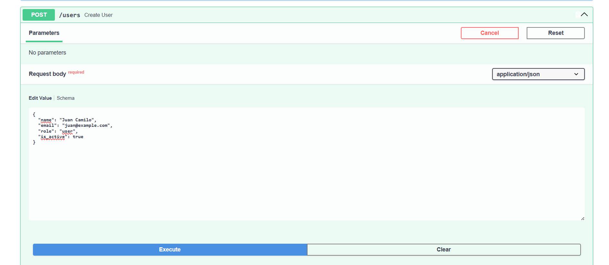
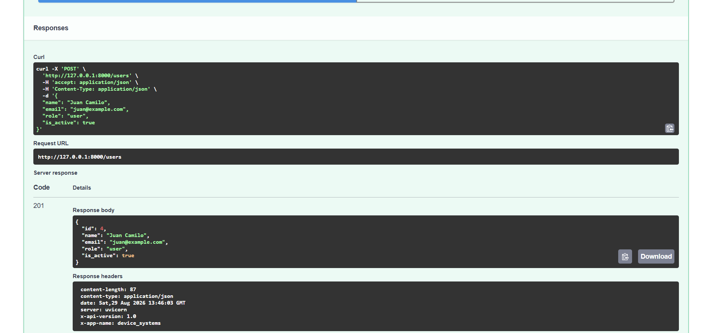
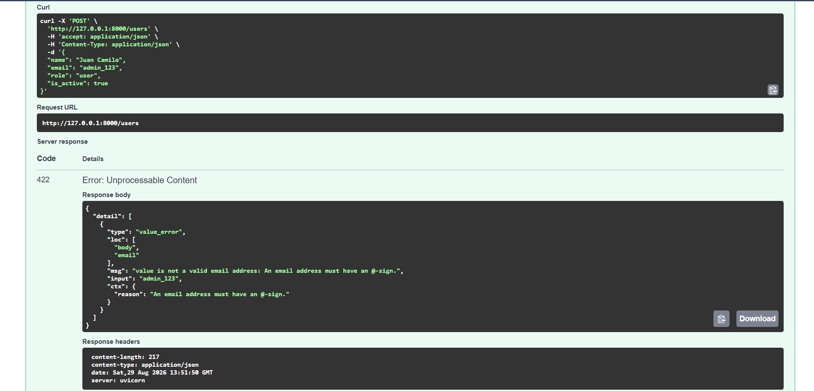

# device_systems API

Evidencia **GA1-220501096-01-AA1-EV07 – Fundamentos de FastAPI: API REST para Gestión de Usuarios**.

`device_systems` es una aplicación backend creada con FastAPI para administrar usuarios mediante una API REST. El proyecto trabaja con métodos HTTP como `GET` y `POST`, parámetros de ruta, parámetros de consulta, validación con Pydantic v2, cabeceras HTTP personalizadas y modelos de respuesta.

## Estructura del proyecto

```text
device_systems/
├── app/
│   ├── main.py
│   ├── routes/
│   │   └── user_routes.py
│   └── schemas/
│       └── user_schema.py
├── images/
│   ├── swagger_ui.png
│   ├── get_users_list.png
│   ├── get_user_by_id.png
│   ├── users_filters.png
│   ├── post_user_swagger.png
│   ├── curl_post_user.png
│   └── validation_error_email.png
├── .gitignore
├── requirements.txt
├── README.md
└── tests/
    └── test_users_api.py
```

## Instalación

Crear y activar el entorno virtual:

```bash
python -m venv .venv
.\.venv\Scripts\activate
```

Instalar dependencias:

```bash
pip install -r requirements.txt
```

## Ejecución del servidor

```bash
uvicorn app.main:app --reload
```

La API queda disponible en:

- API: `http://127.0.0.1:8000`
- Swagger UI: `http://127.0.0.1:8000/docs`
- Redoc: `http://127.0.0.1:8000/redoc`

## Pruebas automatizadas

El proyecto incluye pruebas con `pytest` y `TestClient` para verificar los endpoints principales, filtros, cabeceras, creación de usuarios y validaciones de errores.

```bash
pytest -q
```

## Tabla de endpoints

| Método | Endpoint                | Descripción                          |
| ------ | ----------------------- | ------------------------------------ |
| GET    | `/`                     | Verifica que la API esté funcionando |
| GET    | `/users`                | Lista todos los usuarios             |
| GET    | `/users/{user_id}`      | Consulta un usuario por ID           |
| GET    | `/users?role=admin`     | Filtra usuarios por rol              |
| GET    | `/users?is_active=true` | Filtra usuarios activos o inactivos  |
| POST   | `/users`                | Crea un nuevo usuario                |

## Modelo de usuario

Campos usados por la API:

- `id`: identificador numérico del usuario.
- `name`: nombre obligatorio, mínimo 3 caracteres.
- `email`: correo con formato válido.
- `role`: solo permite `admin`, `support` o `user`.
- `is_active`: valor booleano.

## Ejemplos de peticiones

### Listar usuarios

```bash
curl http://127.0.0.1:8000/users
```

### Buscar usuario por ID

```bash
curl http://127.0.0.1:8000/users/1
```

### Filtrar por rol

```bash
curl "http://127.0.0.1:8000/users?role=admin"
```

### Filtrar por estado

```bash
curl "http://127.0.0.1:8000/users?is_active=true"
```

### Crear usuario

```bash
curl -X POST http://127.0.0.1:8000/users \
  -H "Content-Type: application/json" \
  -d '{"name":"Maria Lopez","email":"maria@example.com","role":"user","is_active":true}'
```

## Ejemplo de respuesta POST

```json
{
  "id": 4,
  "name": "Maria Lopez",
  "email": "maria@example.com",
  "role": "user",
  "is_active": true
}
```

## Validaciones y errores

La API valida los datos con Pydantic v2:

- Si `name` tiene menos de 3 caracteres, la API responde `422 Unprocessable Entity`.
- Si `email` no tiene formato válido, responde `422 Unprocessable Entity`.
- Si `role` no es `admin`, `support` o `user`, responde `422 Unprocessable Entity`.
- Si el correo ya existe, responde `409 Conflict`.
- Si el usuario no existe, responde `404 Not Found`.

## Cabeceras HTTP personalizadas

Los endpoints de la API devuelven las siguiente cabeceras:

```text
X-App-Name: device_systems
X-API-Version: 1.0
```

## Capturas de evidencia

### Swagger UI



### Listado de usuarios



### Consulta de usuario por ID


### Filtros por rol y estado



### Creación de usuario desde Swagger



### Ejemplo de petición con curl


### Validación de email inválido



## Reflexión

FastAPI facilita la construcción de APIs REST porque integra documentación automática, validación de datos y definición clara de modelos de entrada y salida. Pydantic ayuda a prevenir errores desde la entrada de datos y los `response_model` permiten controlar qué información se devuelve al cliente. Separar el proyecto en rutas y esquemas mejora la organización del código y facilita su mantenimiento y expansión.
