# device_systems API

Evidencia **GA1-220501096-01-AA1-EV08 – FastAPI Intermedio: Evolución de device_systems con CRUD Completo, Manejo de Errores, Swagger/OpenAPI y Dependency Injection**.

`device_systems` es una API REST desarrollada con FastAPI para gestionar usuarios del sistema. En esta versión se evoluciona la solución anterior para incluir operaciones completas de CRUD, manejo profesional de errores, reutilización de lógica con `Depends()` y documentación automática con Swagger/OpenAPI.

## Tecnologías utilizadas

- Python 3.11+
- FastAPI
- Pydantic v2
- Uvicorn
- pytest
- TestClient (httpx)

## Estructura del proyecto

```text
device_systems/
├── app/
│   ├── data/
│   │   ├── __init__.py
│   │   └── users_db.py
│   ├── dependencies/
│   │   ├── __init__.py
│   │   └── user_dependencies.py
│   ├── routes/
│   │   ├── __init__.py
│   │   └── user_routes.py
│   ├── schemas/
│   │   ├── __init__.py
│   │   └── user_schema.py
│   ├── services/
│   │   ├── __init__.py
│   │   └── user_service.py
│   ├── __init__.py
│   └── main.py
├── images/
│   ├── ev07_swagger_ui.png
│   ├── ev07_get_users_list.png
│   ├── ev07_get_user_by_id.png
│   ├── ev07_users_filters.png
│   ├── ev07_post_user_swagger.png
│   ├── ev07_curl_post_user.png
│   ├── ev07_validation_error_email.png
│   ├── ev08_swagger_ui.png
│   ├── ev08_redoc_ui.png
│   ├── ev08_get_users_list.png
│   ├── ev08_get_user_by_id.png
│   ├── ev08_users_filters.png
│   ├── ev08_post_user_swagger.png
│   ├── ev08_put_user_swagger.png
│   ├── ev08_patch_user_swagger.png
│   ├── ev08_delete_user_swagger.png
│   ├── ev08_duplicate_email_error.png
│   ├── ev08_user_not_found.png
│   ├── ev08_validation_error_email.png
│   ├── ev08_pytest_results.png
│   └── ev08_gitflow_branches.png
├── tests/
│   └── test_users_api.py
├── .gitignore
├── requirements.txt
└── README.md
```

### Separación de responsabilidades

| Carpeta         | Responsabilidad                                    |
| --------------- | -------------------------------------------------- |
| `routes/`       | Definición de endpoints y decoradores de ruta      |
| `schemas/`      | Modelos Pydantic de entrada y salida               |
| `services/`     | Lógica de negocio                                  |
| `dependencies/` | Funciones reutilizables inyectadas con `Depends()` |
| `data/`         | Simulación de base de datos en memoria             |

## Instalación

Crear y activar el entorno virtual:

```bash
python -m venv .venv
.\.venv\Scripts\activate
```

Instalar dependencias:

```bash
pip install -r requirements.txt
```

## Ejecución del servidor

```bash
uvicorn app.main:app --reload
```

La API queda disponible en:

- API: `http://127.0.0.1:8000`
- Swagger UI: `http://127.0.0.1:8000/docs`
- ReDoc: `http://127.0.0.1:8000/redoc`

## Endpoints

| Método | Endpoint           | Descripción                        |
| ------ | ------------------ | ---------------------------------- |
| GET    | `/`                | Verifica el estado de la API       |
| GET    | `/users`           | Lista todos los usuarios           |
| GET    | `/users/{user_id}` | Consulta un usuario por ID         |
| POST   | `/users`           | Crea un usuario                    |
| PUT    | `/users/{user_id}` | Actualiza un usuario completamente |
| PATCH  | `/users/{user_id}` | Actualiza parcialmente un usuario  |
| DELETE | `/users/{user_id}` | Elimina un usuario                 |

## Modelo de usuario

- `id`: identificador numérico (asignado automáticamente).
- `name`: obligatorio, mínimo 3 caracteres.
- `email`: formato válido y único.
- `role`: valores permitidos: `admin`, `support`, `user`.
- `is_active`: valor booleano.

## Códigos HTTP utilizados

| Operación               | Código                   |
| ----------------------- | ------------------------ |
| GET /users              | 200 OK                   |
| GET /users/{user_id}    | 200 OK                   |
| POST /users             | 201 Created              |
| PUT /users/{user_id}    | 200 OK                   |
| PATCH /users/{user_id}  | 200 OK                   |
| DELETE /users/{user_id} | 204 No Content           |
| Usuario no encontrado   | 404 Not Found            |
| Correo duplicado        | 400 Bad Request          |
| Datos inválidos         | 422 Unprocessable Entity |

## Dependency Injection (`Depends()`)

La lógica reutilizable se encapsuló en `app/dependencies/user_dependencies.py` para evitar duplicar validaciones y mantener la API ordenada.

### Dependencias implementadas

| Dependencia                        | Descripción                                                | Usada en                       |
| ---------------------------------- | ---------------------------------------------------------- | ------------------------------ |
| `get_user_or_404(user_id)`         | Busca un usuario por ID y lanza `404` si no existe         | GET, PUT, PATCH, DELETE por ID |
| `get_api_config()`                 | Retorna la configuración general de la API                 | Health check (`/`)             |
| `validate_email_not_exists(email)` | Valida que un correo no esté duplicado                     | Disponible para inyección      |
| `validate_role(role)`              | Valida que el rol sea permitido                            | Disponible para inyección      |
| `get_current_user_agent(...)`      | Simula autenticación básica leyendo el header `User-Agent` | Disponible para inyección      |

### Ejemplo de uso

```python
# Dependencia definida en dependencies/user_dependencies.py
def get_user_or_404(user_id: int):
    user = next((u for u in users_db if u["id"] == user_id), None)
    if user is None:
        raise HTTPException(status_code=404, detail="Usuario no encontrado")
    return user
```

```python
# Inyección en la ruta con Depends()
@router.put("/{user_id}")
def update_user_full(
    user_data: UserUpdate,
    response: Response,
    user: dict = Depends(get_user_or_404),   # <-- inyección
) -> dict:
    return UserService.update_user_full(user, user_data)
```

De esta forma, la verificación del usuario se reutiliza en los endpoints GET, PUT, PATCH y DELETE sin repetir lógica. FastAPI resuelve automáticamente el parámetro `user_id` de la URL y lo pasa a la dependencia.

## Manejo de errores

Se implementaron respuestas claras con `HTTPException`:

| Error controlado             | Código | Mensaje                                           |
| ---------------------------- | ------ | ------------------------------------------------- |
| Usuario no encontrado        | 404    | `"Usuario no encontrado"`                         |
| Correo electrónico duplicado | 400    | `"Correo electrónico duplicado"`                  |
| Rol no permitido             | 422    | Validación automática de Pydantic con `Literal`   |
| PATCH sin campos             | 400    | `"Debe enviar al menos un campo para actualizar"` |
| Datos inválidos              | 422    | Validación automática de Pydantic                 |

Ejemplo de respuesta de error:

```json
{
  "detail": "Usuario no encontrado"
}
```

## Ejemplos de peticiones

### Listar usuarios

```bash
curl http://127.0.0.1:8000/users
```

### Filtrar por rol

```bash
curl "http://127.0.0.1:8000/users?role=admin"
```

### Crear usuario

```bash
curl -X POST http://127.0.0.1:8000/users \
  -H "Content-Type: application/json" \
  -d '{"name":"Maria Lopez","email":"maria@example.com","role":"user","is_active":true}'
```

### Actualizar completamente (PUT)

```bash
curl -X PUT http://127.0.0.1:8000/users/1 \
  -H "Content-Type: application/json" \
  -d '{"name":"Carlos Actualizado","email":"carlos.act@example.com","role":"support","is_active":false}'
```

### Actualizar parcialmente (PATCH)

```bash
curl -X PATCH http://127.0.0.1:8000/users/1 \
  -H "Content-Type: application/json" \
  -d '{"role":"support"}'
```

### Eliminar usuario

```bash
curl -X DELETE http://127.0.0.1:8000/users/1
```

## Pruebas automatizadas

```bash
pytest -v
```

Se incluyen 18 tests que cubren:

- Health check con headers personalizados.
- Listado y filtrado de usuarios.
- Creación con validación de datos.
- Correo duplicado, nombre corto, email inválido, rol inválido.
- Usuario inexistente.
- Actualización completa (PUT) y parcial (PATCH).
- PATCH vacío → 400.
- Eliminación y eliminación de usuario inexistente.
- Generación correcta del esquema OpenAPI.
- Carga de la página ReDoc con un bundle estable.

## Capturas de evidencia

### Swagger UI


### Listado de usuarios


### Consulta de usuario por ID

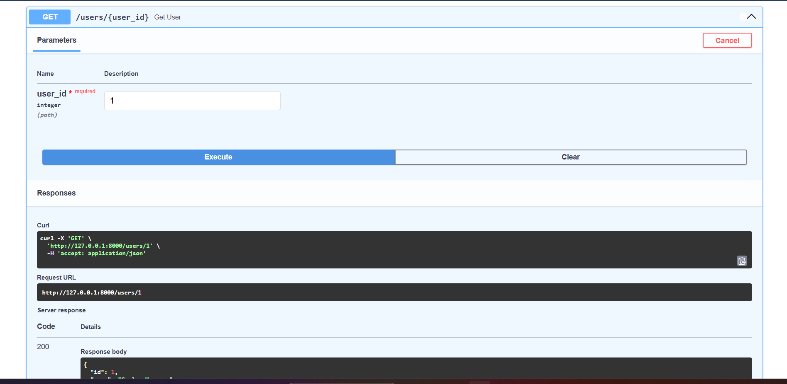

### Filtros por rol y estado


### Creación de usuario desde Swagger


### Ejemplo de petición con curl

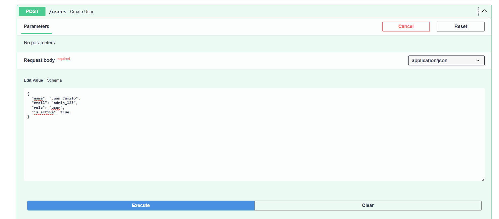

### Validación de email inválido


### Evidencia 8: ReDoc

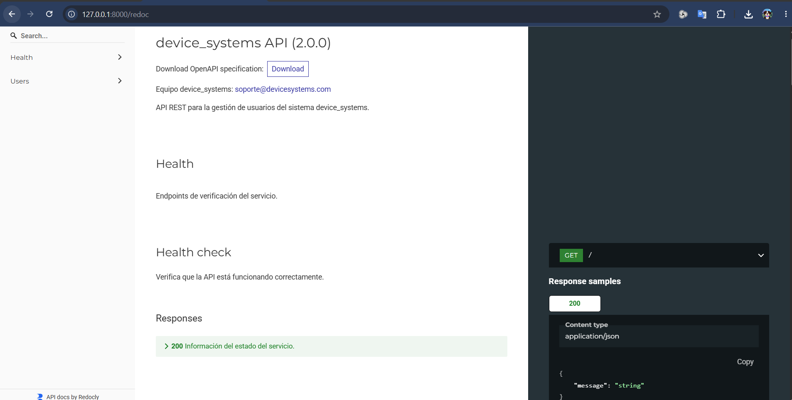

### Evidencia 8: listado de usuarios

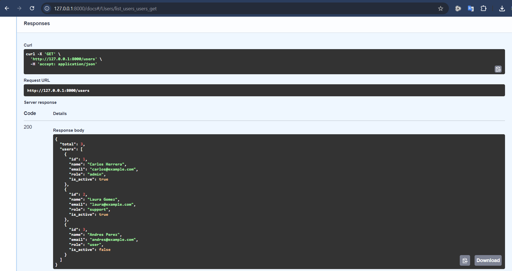

### Evidencia 8: consulta por ID

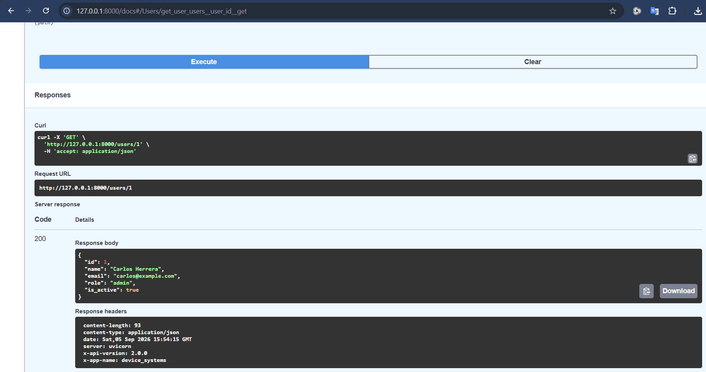

### Evidencia 8: filtros de usuarios

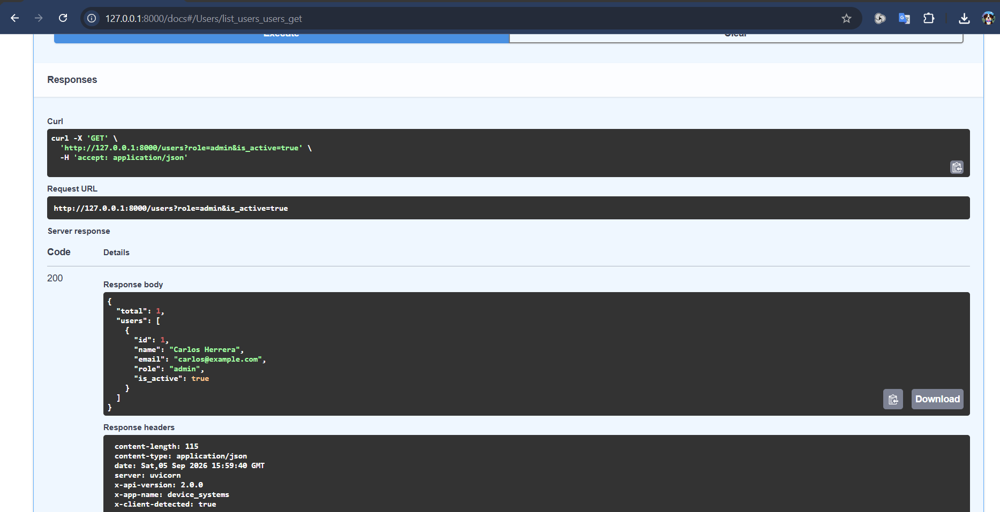

### Evidencia 8: creación de usuario

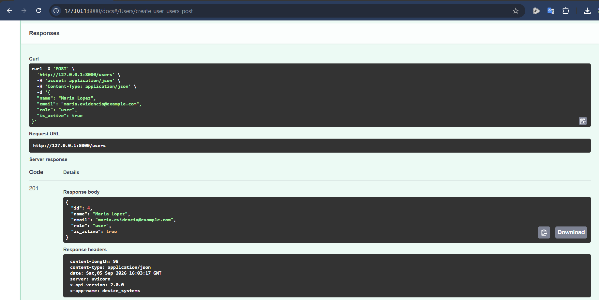

### Evidencia 8: actualización completa con PUT

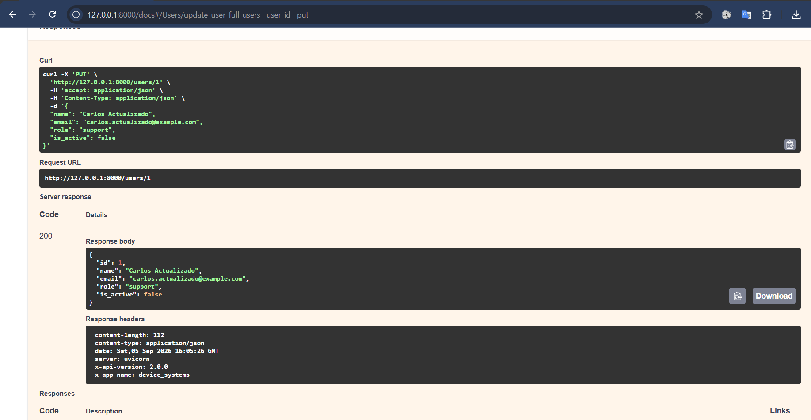

### Evidencia 8: actualización parcial con PATCH

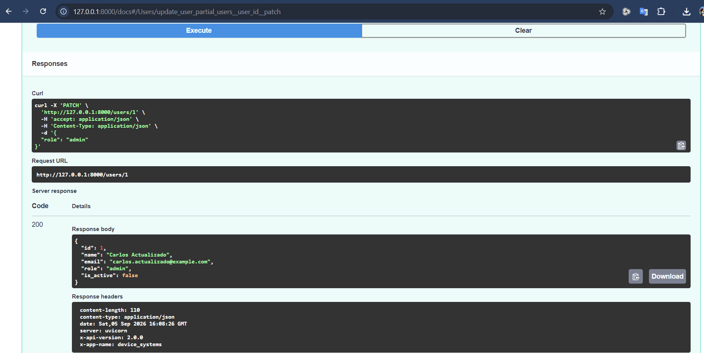

### Evidencia 8: eliminación con DELETE

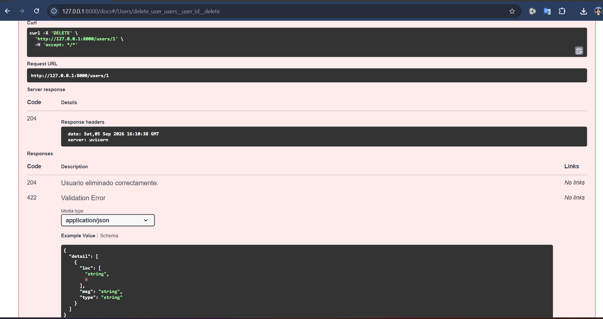

### Evidencia 8: error por correo duplicado

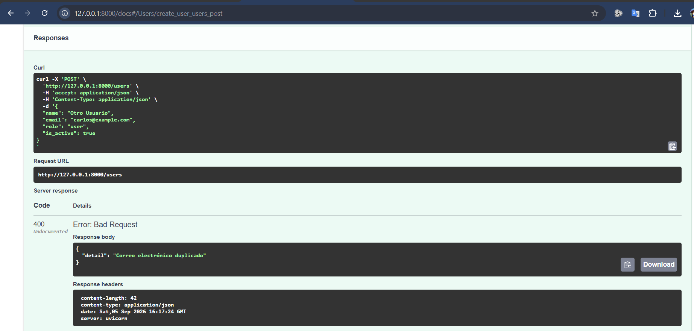

### Evidencia 8: usuario no encontrado

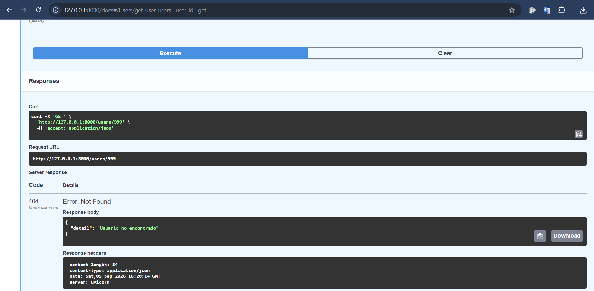

### Evidencia 8: error de validación

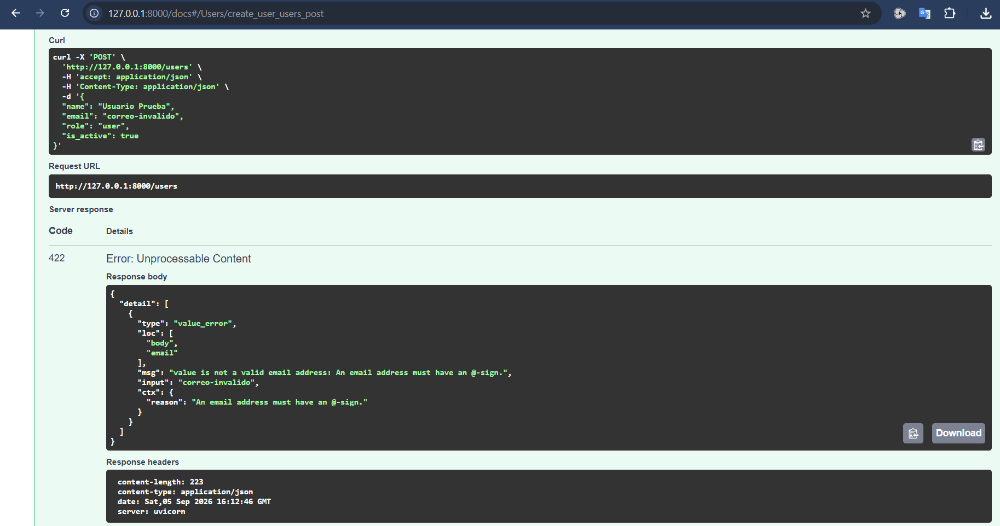

### Evidencia 8: pruebas automatizadas

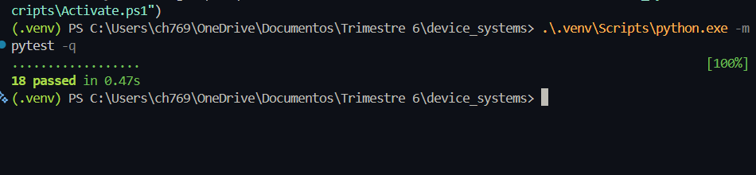

### Evidencia 8: ramas y commits de GitFlow

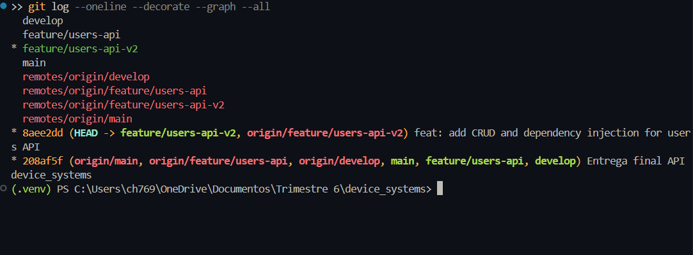

## Reflexión

La evolución de la API desde una versión básica hasta esta versión intermedia demuestra cómo FastAPI facilita la construcción de servicios REST más profesionales. La separación de rutas, servicios, dependencias y datos mejora la mantenibilidad del proyecto. La gestión de errores con `HTTPException` hace que la API responda de forma clara y controlada, mientras que `Depends()` permite reutilizar lógica común — como la verificación de existencia de un usuario — en múltiples endpoints sin duplicar código. Además, la documentación automática con Swagger/OpenAPI facilita la prueba, validación y comprensión del backend por parte de otros desarrolladores.

## GitFlow aplicado

Se aplicó una estructura simple de GitFlow para la entrega del proyecto:

- `main`: versión final estable
- `develop`: integración del desarrollo
- `feature/users-api-v2`: rama de la nueva evolución del proyecto

La estrategia permite trabajar en funcionalidad específica y mantener el proyecto organizado por etapas.
