# device_systems API

Evidencia **GA1-220501096-01-AA1-EV10 - FastAPI Avanzado: Migraciones con Alembic, Asociaciones de Modelos y Consultas con Joins en device_systems**.

`device_systems` es una API REST desarrollada con FastAPI para gestionar usuarios, dispositivos y préstamos tecnológicos, aplicando relaciones entre modelos, migraciones con Alembic y consultas avanzadas con joins. La solución conserva el recurso base `/users`, incorpora `/devices` y `/loans`, y usa SQLite como motor de persistencia con SQLAlchemy.

## Tecnologías utilizadas

- Python 3.13
- FastAPI
- Uvicorn
- SQLAlchemy
- Alembic
- SQLite
- Pydantic v2
- pytest
- TestClient con httpx

## Estructura del proyecto

```text
device_systems/
|-- alembic/
|   |-- versions/
|   |   `-- e93a42c8a2b1_create_devices_and_loans_tables.py
|   |-- env.py
|   |-- README
|   `-- script.py.mako
|-- app/
|   |-- __init__.py
|   |-- main.py
|   |-- database/
|   |   |-- __init__.py
|   |   `-- connection.py
|   |-- dependencies/
|   |   |-- database_dependency.py
|   |   |-- device_dependencies.py
|   |   |-- loan_dependencies.py
|   |   |-- user_dependencies.py
|   |-- models/
|   |   |-- __init__.py
|   |   |-- user_model.py
|   |   |-- device_model.py
|   |   |-- loan_model.py
|   |-- routes/
|   |   |-- __init__.py
|   |   |-- user_routes.py
|   |   |-- device_routes.py
|   |   |-- loan_routes.py
|   |-- schemas/
|   |   |-- __init__.py
|   |   |-- user_schema.py
|   |   |-- device_schema.py
|   |   |-- loan_schema.py
|   |-- services/
|   |   |-- __init__.py
|   |   |-- user_service.py
|   |   |-- device_service.py
|   |   |-- loan_service.py
|-- images/
|   |-- ev10_alembic_revision.png
|   |-- ev10_alembic_upgrade.png
|   |-- ev10_alembic_history.png
|   |-- ev10_swagger_ui.png
|   |-- ev10_estructura_tablas.png
|   |-- ev10_create_user.png
|   |-- ev10_create_device.png
|   |-- ev10_create_loan.png
|   |-- ev10_loans_details.png
|   |-- ev10_filters_status.png
|   |-- ev10_filters_device_type.png
|   |-- ev10_user_loans.png
|   |-- ev10_return_loan.png
|   |-- ev10_pytest_results.png
|-- tests/
|   |-- test_users_api.py
|   `-- test_ev10_relations.py
|-- .gitignore
|-- alembic.ini
|-- pytest.ini
|-- requirements.txt
|-- device_systems.db
`-- README.md
```

## Instalación

Crear y activar el entorno virtual:

```bash
python -m venv .venv
.\.venv\Scripts\activate
```

Instalar dependencias:

```bash
pip install -r requirements.txt
```

Dependencias principales:

- `fastapi`
- `uvicorn`
- `sqlalchemy`
- `alembic`
- `pydantic[email]`
- `pytest`
- `httpx`

## Ejecución del servidor

```bash
uvicorn app.main:app --reload
```

La API queda disponible en:

- API: `http://127.0.0.1:8000`
- Swagger UI: `http://127.0.0.1:8000/docs`
- ReDoc: `http://127.0.0.1:8000/redoc`

La rama de entrega solicitada es `device_systems_alembic_relaciones`.

## Configuración de SQLAlchemy y Alembic

La conexión de la base de datos se define en `app/database/connection.py`:

```python
DATABASE_URL = "sqlite:///./device_systems.db"
```

Alembic se configura en:

- `alembic.ini`
- `alembic/env.py`

Con esto se logra:

- controlar cambios de estructura
- versionar tablas y relaciones
- aplicar migraciones de forma reproducible
- mantener consistencia entre entorno de desarrollo y base de datos

## Migraciones con Alembic

Inicializar Alembic:

```bash
alembic init alembic
```

Generar una migración automática con autogenerate:

```bash
alembic revision --autogenerate -m "create devices and loans tables"
```

Aplicar migración:

```bash
alembic upgrade head
```

Ver historial:

```bash
alembic history
```

## Modelos del sistema

### User

Representa a los usuarios del sistema.

| Campo        | Tipo     | Restricción           |
| ------------ | -------- | --------------------- |
| `id`         | Integer  | PK                    |
| `name`       | String   | Obligatorio           |
| `email`      | String   | Único y obligatorio   |
| `role`       | String   | admin, support o user |
| `is_active`  | Boolean  | Por defecto `True`    |
| `created_at` | DateTime | Fecha de registro     |

### Device

Representa un equipo tecnológico disponible para préstamo.

| Campo           | Tipo     | Restricción                                        |
| --------------- | -------- | -------------------------------------------------- |
| `id`            | Integer  | PK                                                 |
| `name`          | String   | Obligatorio                                        |
| `serial_number` | String   | Único y obligatorio                                |
| `device_type`   | String   | laptop, tablet, proyector, camara, router, monitor |
| `brand`         | String   | Opcional                                           |
| `is_available`  | Boolean  | Por defecto `True`                                 |
| `created_at`    | DateTime | Fecha de creación                                  |

### Loan

Representa el préstamo de un dispositivo a un usuario.

| Campo         | Tipo     | Restricción                |
| ------------- | -------- | -------------------------- |
| `id`          | Integer  | PK                         |
| `user_id`     | Integer  | FK a `users.id`            |
| `device_id`   | Integer  | FK a `devices.id`          |
| `loan_date`   | DateTime | Fecha de préstamo          |
| `return_date` | DateTime | Opcional                   |
| `status`      | String   | active, returned o overdue |

## Relaciones entre modelos

Se usan relaciones con `relationship()` y `back_populates()`:

- `User.loans` -> muchos préstamos por usuario
- `Device.loans` -> historial de préstamos por dispositivo
- `Loan.user` -> usuario relacionado
- `Loan.device` -> dispositivo relacionado

Esto permite consultar información relacionada entre tablas con joins y evitar duplicación de datos en la lógica de negocio.

## Schemas Pydantic

Los schemas están organizados por recurso:

- `user_schema.py`
- `device_schema.py`
- `loan_schema.py`

Incluyen:

- `Create`
- `Update`
- `Patch`
- `Response`
- `ListResponse`
- `DetailResponse`

## Endpoints principales

### Users

| Método | Endpoint           | Descripción                 |
| ------ | ------------------ | --------------------------- |
| GET    | `/users`           | Listar usuarios             |
| GET    | `/users/{user_id}` | Consultar usuario           |
| POST   | `/users`           | Crear usuario               |
| PUT    | `/users/{user_id}` | Actualizar usuario completo |
| PATCH  | `/users/{user_id}` | Actualizar parcial          |
| DELETE | `/users/{user_id}` | Eliminar usuario            |

### Devices

| Método | Endpoint               | Descripción            |
| ------ | ---------------------- | ---------------------- |
| GET    | `/devices`             | Listar dispositivos    |
| GET    | `/devices/{device_id}` | Consultar dispositivo  |
| POST   | `/devices`             | Crear dispositivo      |
| PUT    | `/devices/{device_id}` | Actualizar dispositivo |
| PATCH  | `/devices/{device_id}` | Actualizar parcial     |
| DELETE | `/devices/{device_id}` | Eliminar dispositivo   |

### Loans

| Método | Endpoint                     | Descripción                            |
| ------ | ---------------------------- | -------------------------------------- |
| GET    | `/loans`                     | Listar préstamos                       |
| GET    | `/loans/details`             | Consultar datos relacionados con joins |
| GET    | `/loans/{loan_id}`           | Consultar préstamo por ID              |
| GET    | `/users/{user_id}/loans`     | Ver préstamos de un usuario            |
| GET    | `/devices/{device_id}/loans` | Ver historial del dispositivo          |
| POST   | `/loans`                     | Crear préstamo                         |
| PATCH  | `/loans/{loan_id}/return`    | Devolver dispositivo                   |

## Filtros avanzados

Se implementaron filtros para:

- `GET /devices?device_type=laptop`
- `GET /devices?is_available=true`
- `GET /devices?brand=lenovo`
- `GET /devices?search=thinkpad`
- `GET /loans?status=active`
- `GET /loans?user_email=ana@sena.edu.co`
- `GET /loans?device_type=laptop`
- `GET /users/1/loans`
- `GET /devices/1/loans`

## Reglas de negocio

La aplicación valida correctamente:

- usuario inexistente
- dispositivo inexistente
- dispositivo no disponible
- préstamo inexistente
- préstamo ya devuelto
- serial duplicado
- filtros inválidos

### Códigos esperados

| Caso                        | Código                     |
| --------------------------- | -------------------------- |
| Registro creado             | `201 Created`              |
| Consulta exitosa            | `200 OK`                   |
| Devolución exitosa          | `200 OK`                   |
| Eliminación exitosa         | `204 No Content`           |
| Recurso no encontrado       | `404 Not Found`            |
| Dato duplicado              | `400 Bad Request`          |
| Regla de negocio incumplida | `409 Conflict`             |
| Error de validación         | `422 Unprocessable Entity` |

## Ejemplos de uso

### Crear usuario

```bash
curl -X POST "http://127.0.0.1:8000/users" \
  -H "Content-Type: application/json" \
  -d '{"name":"Ana Perez","email":"ana@sena.edu.co","role":"admin","is_active":true}'
```

### Crear dispositivo

```bash
curl -X POST "http://127.0.0.1:8000/devices" \
  -H "Content-Type: application/json" \
  -d '{"name":"Laptop Lenovo ThinkPad","serial_number":"LEN-2024-001","device_type":"laptop","brand":"Lenovo","is_available":true}'
```

### Crear préstamo

```bash
curl -X POST "http://127.0.0.1:8000/loans" \
  -H "Content-Type: application/json" \
  -d '{"user_id":1,"device_id":1,"status":"active"}'
```

### Consultar préstamos con información relacionada

```bash
curl "http://127.0.0.1:8000/loans/details"
```

### Devolver dispositivo

```bash
curl -X PATCH "http://127.0.0.1:8000/loans/1/return"
```

## Pruebas automatizadas

Se ejecutan pruebas con `pytest` para verificar:

- creación de usuario
- creación de dispositivo
- creación de préstamo
- validación de disponibilidad
- devolución de equipo
- filtrado por estado y tipo de dispositivo
- consumo de historial por usuario y por dispositivo

```bash
pytest -q
```

Resultado validado:

```text
25 passed en la suite completa
```

## Evidencias de aprendizaje

### 1. Inicialización de Alembic

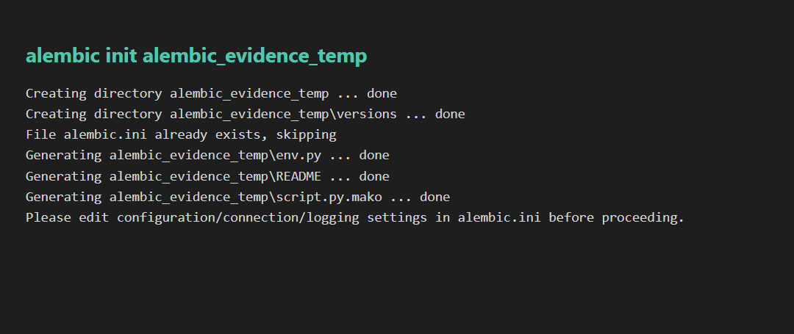

### 2. Generación de migración

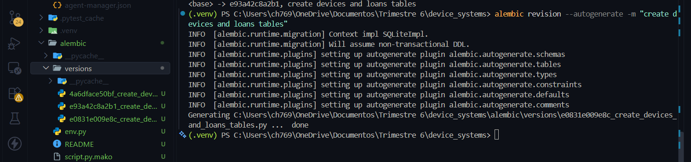

### 3. Aplicación de la migración

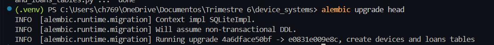

### 4. Historial de migraciones

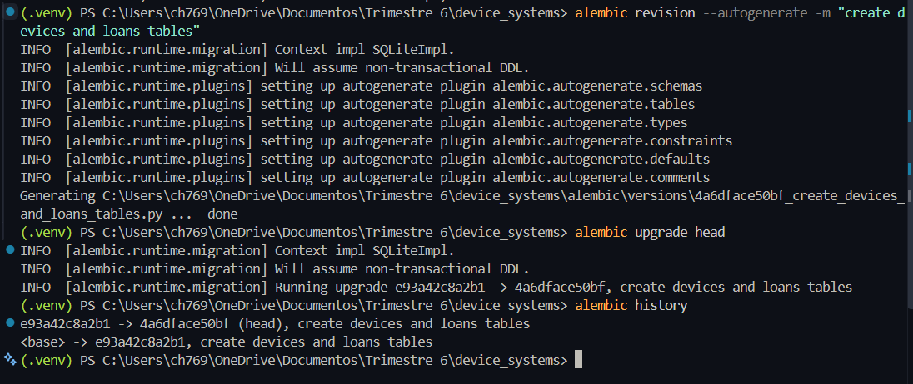

### 5. Estructura de tablas generadas

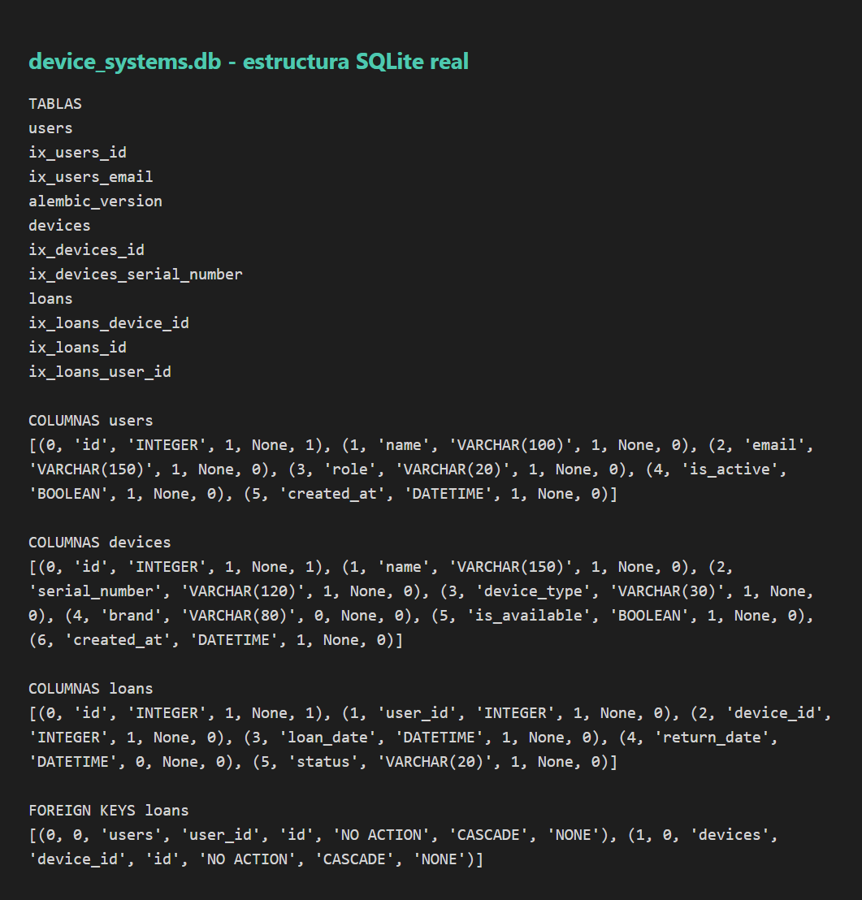

### 6. Swagger UI

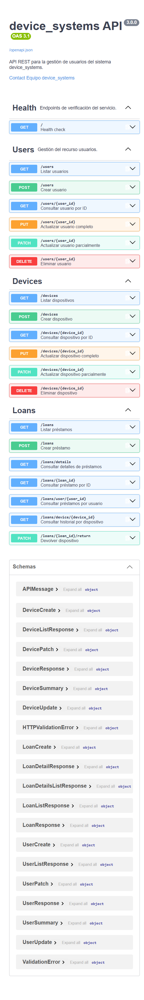

### 7. Creación de usuario

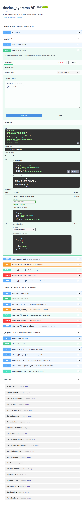

### 8. Creación de dispositivo

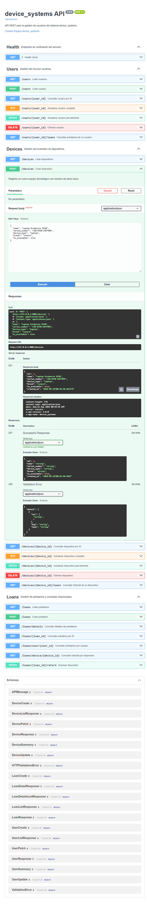

### 9. Creación de préstamo

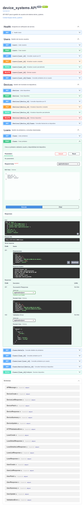

### 10. Usuarios registrados mediante la API

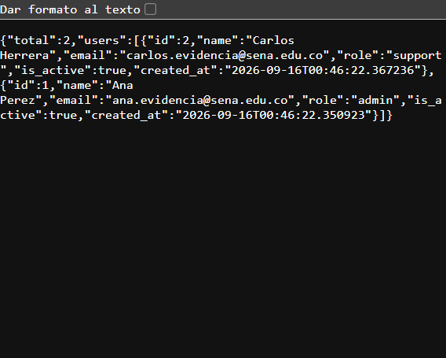

### 11. Dispositivos registrados mediante la API

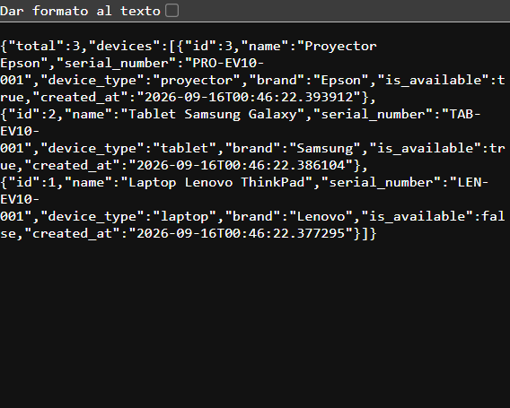

### 12. Consultas con joins

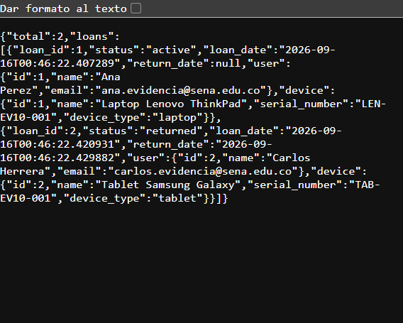

### 13. Filtro por estado y correo

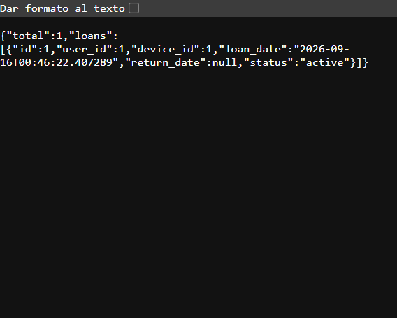

### 14. Filtro por tipo de dispositivo

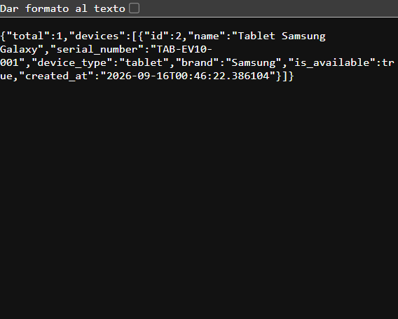

### 15. Préstamos de un usuario

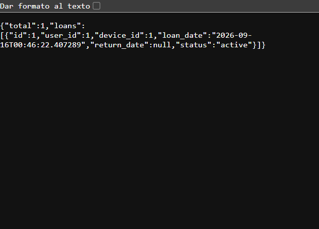

### 16. Devolución de un préstamo

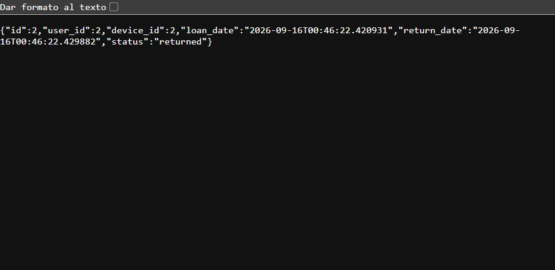

### 17. Resultado de pruebas automatizadas

La validación se puede reproducir con `pytest -q` y se muestra en la captura:

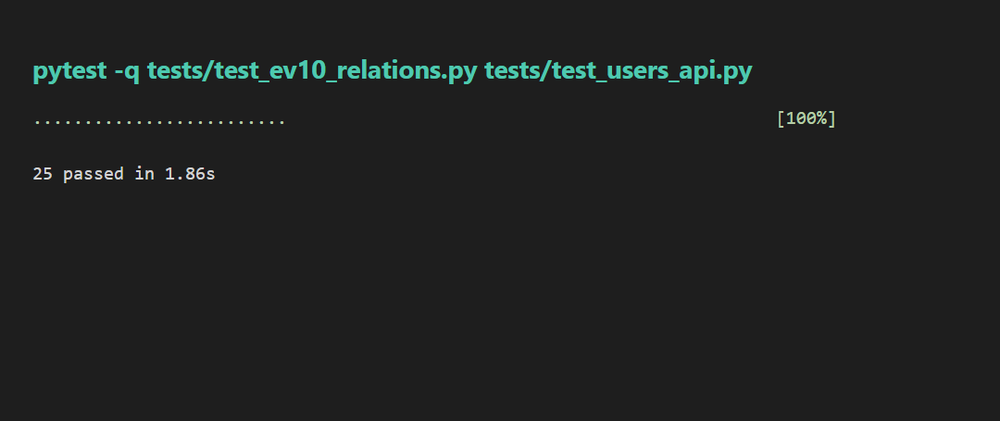

```text
25 passed en la suite completa
```

## Reflexión final

La migración de esquemas con Alembic, junto con las relaciones de SQLAlchemy y las consultas con joins, permite transformar una API monolítica en un sistema más robusto, mantenible y profesional. Esto permite que el backend no solo gestione usuarios de forma aislada, sino que también modele relaciones reales entre entidades, garantice integridad referencial y pueda responder consultas complejas con datos conectados entre tablas.
