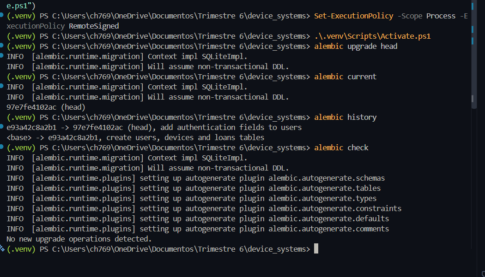
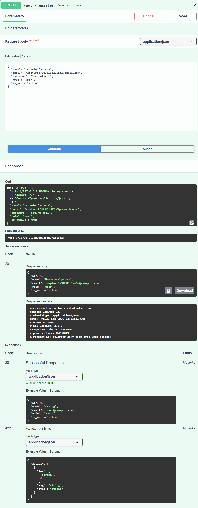
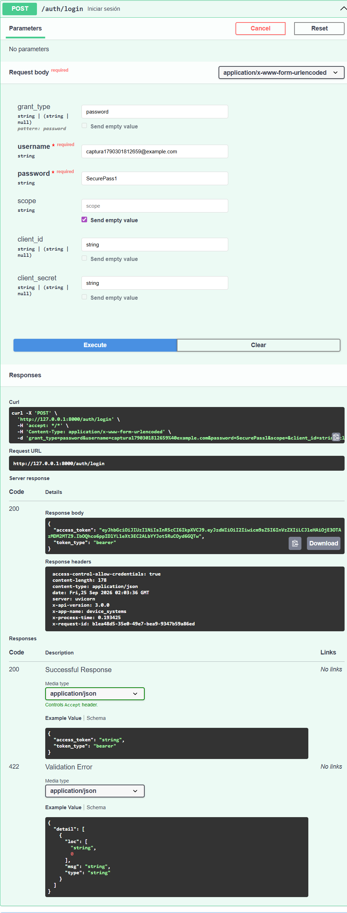
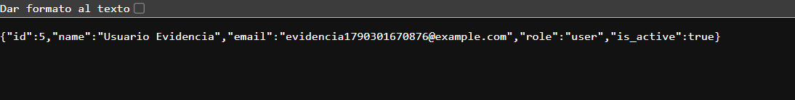
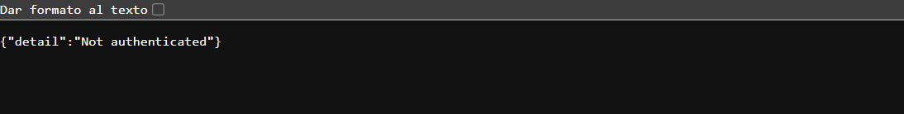
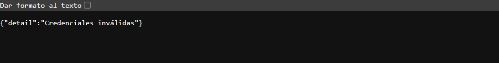
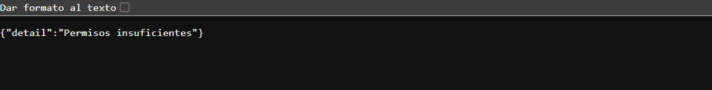
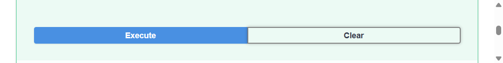
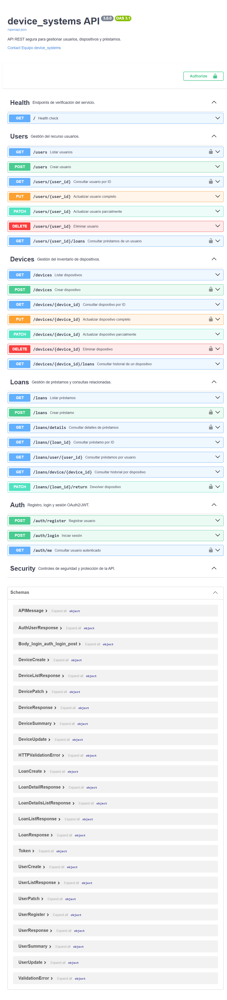

# device_systems API

Evidencia **GA1-220501096-01-AA1-EV11 - FastAPI Seguridad: Autenticación, Middleware, CORS, Rate Limiting y Validación Avanzada en device_systems**.

`device_systems` es una API REST segura desarrollada con FastAPI para gestionar usuarios, dispositivos y préstamos tecnológicos. Esta versión implementa registro, login OAuth2/JWT, hash de contraseñas, autorización por roles, middleware de trazabilidad, CORS, rate limiting y validaciones avanzadas con Pydantic v2.

## Tecnologías utilizadas

- Python 3.13
- FastAPI
- Uvicorn
- SQLAlchemy
- Alembic
- python-jose
- passlib y bcrypt
- slowapi
- python-dotenv
- SQLite
- Pydantic v2
- pytest
- TestClient con httpx

## Estructura del proyecto

```text
device_systems/
|-- alembic/
|   |-- versions/
|   |   |-- e93a42c8a2b1_create_devices_and_loans_tables.py
|   |   `-- 97e7fe4102ac_add_authentication_fields_to_users.py
|   |-- env.py
|   |-- README
|   `-- script.py.mako
|-- app/
|   |-- __init__.py
|   |-- main.py
|   |-- auth/
|   |   |-- __init__.py
|   |   |-- auth_routes.py
|   |   |-- auth_service.py
|   |   `-- security.py
|   |-- database/
|   |   |-- __init__.py
|   |   `-- connection.py
|   |-- dependencies/
|   |   |-- database_dependency.py
|   |   |-- auth_dependency.py
|   |   |-- device_dependencies.py
|   |   |-- loan_dependencies.py
|   |   |-- user_dependencies.py
|   |-- models/
|   |   |-- __init__.py
|   |   |-- user_model.py
|   |   |-- device_model.py
|   |   |-- loan_model.py
|   |-- routes/
|   |   |-- __init__.py
|   |   |-- user_routes.py
|   |   |-- device_routes.py
|   |   |-- loan_routes.py
|   |-- schemas/
|   |   |-- __init__.py
|   |   |-- auth_schema.py
|   |   |-- user_schema.py
|   |   |-- device_schema.py
|   |   |-- loan_schema.py
|   |-- services/
|   |   |-- __init__.py
|   |   |-- user_service.py
|   |   |-- device_service.py
|   |   |-- loan_service.py
|   |-- middlewares/
|   |   |-- __init__.py
|   |   `-- request_middleware.py
|   |-- security/
|   |   |-- __init__.py
|   |   `-- rate_limit.py
|-- .env.example
|-- images/
|   |-- ev11_register.png
|   |-- ev11_login.png
|   |-- ev11_auth_me.png
|   |-- ev11_no_token.png
|   |-- ev11_invalid_token.png
|   |-- ev11_forbidden.png
|   |-- ev11_rate_limit.png
|   |-- ev11_swagger_oauth2.png
|-- tests/
|   |-- test_users_api.py
|   |-- test_ev10_relations.py
|   `-- test_ev11_security.py
|-- .gitignore
|-- alembic.ini
|-- pytest.ini
|-- requirements.txt
|-- device_systems.db
`-- README.md
```

## Instalación

Crear y activar el entorno virtual:

```bash
python -m venv .venv
.\.venv\Scripts\activate
```

Instalar dependencias:

```bash
pip install -r requirements.txt
```

Dependencias principales:

- `fastapi`
- `uvicorn`
- `sqlalchemy`
- `alembic`
- `pydantic[email]`
- `python-jose[cryptography]`
- `passlib==1.7.4` y `bcrypt==4.0.1`
- `slowapi`
- `python-multipart`
- `python-dotenv`
- `pytest`
- `httpx`

## Configuración de seguridad

Copiar `.env.example` como `.env` y cambiar la clave antes de usar la API fuera de desarrollo:

```text
JWT_SECRET_KEY=change-this-secret-in-production
JWT_ALGORITHM=HS256
JWT_ACCESS_TOKEN_EXPIRE_MINUTES=30
ALLOWED_ORIGINS=http://localhost:5173,http://localhost:3000
```

Las contraseñas requieren mínimo 8 caracteres, mayúscula, minúscula, número y ningún espacio.
Se almacenan únicamente como hash bcrypt y `hashed_password` nunca aparece en los schemas de respuesta.

El registro público no permite autoasignar el rol `admin`; ese rol debe asignarse mediante un proceso administrativo controlado.

### OAuth2, JWT y roles

| Método | Endpoint         | Protección                            |
| ------ | ---------------- | ------------------------------------- |
| POST   | `/auth/register` | Pública, con validación de contraseña |
| POST   | `/auth/login`    | Pública, devuelve token Bearer        |
| GET    | `/auth/me`       | Token JWT obligatorio                 |

- `user`: puede consultar y crear préstamos.
- `support`: puede crear y actualizar dispositivos y devolver préstamos.
- `admin`: puede realizar operaciones administrativas, incluida la eliminación de dispositivos.

Las rutas privadas responden `401 Unauthorized` sin token o con token inválido y `403 Forbidden` cuando el rol no tiene permisos.

### Middleware y CORS

Cada respuesta incorpora `X-App-Name`, `X-API-Version`, `X-Process-Time` y `X-Request-ID`. El `X-Request-ID` recibido se propaga o se genera automáticamente.

CORS permite `http://localhost:5173` y `http://localhost:3000`, con credenciales, métodos y headers habilitados. No se usa `*` como origen cuando hay credenciales porque permitiría que cualquier sitio realice peticiones autenticadas.

### Rate limiting

| Endpoint              | Límite        |
| --------------------- | ------------- |
| POST `/auth/login`    | 5 por minuto  |
| POST `/auth/register` | 3 por minuto  |
| GET `/users`          | 30 por minuto |
| POST `/loans`         | 10 por minuto |

Cuando se supera el límite, SlowAPI responde `429 Too Many Requests`.

## Migraciones con Alembic

La migración de autenticación agrega `hashed_password` a la tabla `users`; los campos `role` e `is_active` ya forman parte del esquema base.

```bash
alembic history
alembic upgrade head
alembic check
```

La revisión actual confirma que no existen operaciones pendientes de migración.

### Evidencia de migración aplicada



Resultado real de la verificación:

```text
97e7fe4102ac (head)
No new upgrade operations detected.
```

## Evidencia visual EV11

### Registro y login







### Validación de autenticación







### Rate limiting y Swagger OAuth2





### Video de demostración

<video controls width="100%" src="video/device_systems%20API%20-%20Swagger%20UI%20-%20Google%20Chrome%202026-09-26%2015-29-03.mp4"></video>

### enlace del video

https://youtu.be/n8r5sJHEGKE

## Modelos del sistema

### User

Representa a los usuarios del sistema.

| Campo             | Tipo     | Restricción                  |
| ----------------- | -------- | ---------------------------- |
| `id`              | Integer  | PK                           |
| `name`            | String   | Obligatorio                  |
| `email`           | String   | Único y obligatorio          |
| `hashed_password` | String   | Hash bcrypt, nunca se expone |
| `role`            | String   | admin, support o user        |
| `is_active`       | Boolean  | Por defecto `True`           |
| `created_at`      | DateTime | Fecha de registro            |

### Device

Representa un equipo tecnológico disponible para préstamo.

| Campo           | Tipo     | Restricción                                        |
| --------------- | -------- | -------------------------------------------------- |
| `id`            | Integer  | PK                                                 |
| `name`          | String   | Obligatorio                                        |
| `serial_number` | String   | Único y obligatorio                                |
| `device_type`   | String   | laptop, tablet, proyector, camara, router, monitor |
| `brand`         | String   | Opcional                                           |
| `is_available`  | Boolean  | Por defecto `True`                                 |
| `created_at`    | DateTime | Fecha de creación                                  |

### Loan

Representa el préstamo de un dispositivo a un usuario.

| Campo         | Tipo     | Restricción                |
| ------------- | -------- | -------------------------- |
| `id`          | Integer  | PK                         |
| `user_id`     | Integer  | FK a `users.id`            |
| `device_id`   | Integer  | FK a `devices.id`          |
| `loan_date`   | DateTime | Fecha de préstamo          |
| `return_date` | DateTime | Opcional                   |
| `status`      | String   | active, returned o overdue |

## Relaciones entre modelos

Se usan relaciones con `relationship()` y `back_populates()`:

- `User.loans` -> muchos préstamos por usuario
- `Device.loans` -> historial de préstamos por dispositivo
- `Loan.user` -> usuario relacionado
- `Loan.device` -> dispositivo relacionado

Esto permite consultar información relacionada entre tablas con joins y evitar duplicación de datos en la lógica de negocio.

## Schemas Pydantic

Los schemas están organizados por recurso:

- `auth_schema.py`
- `user_schema.py`
- `device_schema.py`
- `loan_schema.py`

Incluyen:

- `Create`
- `Update`
- `Patch`
- `Response`
- `ListResponse`
- `DetailResponse`

## Endpoints principales

### Users

| Método | Endpoint           | Descripción                    |
| ------ | ------------------ | ------------------------------ |
| GET    | `/users`           | Listar usuarios                |
| GET    | `/users/{user_id}` | Consultar usuario              |
| POST   | `/users`           | Crear usuario, solo admin      |
| PUT    | `/users/{user_id}` | Actualizar usuario, solo admin |
| PATCH  | `/users/{user_id}` | Actualizar usuario, solo admin |
| DELETE | `/users/{user_id}` | Eliminar usuario, solo admin   |

### Devices

| Método | Endpoint               | Descripción                             |
| ------ | ---------------------- | --------------------------------------- |
| GET    | `/devices`             | Listar dispositivos                     |
| GET    | `/devices/{device_id}` | Consultar dispositivo                   |
| POST   | `/devices`             | Crear dispositivo, admin o support      |
| PUT    | `/devices/{device_id}` | Actualizar dispositivo, admin o support |
| PATCH  | `/devices/{device_id}` | Actualizar dispositivo, admin o support |
| DELETE | `/devices/{device_id}` | Eliminar dispositivo, solo admin        |

### Loans

| Método | Endpoint                     | Descripción                           |
| ------ | ---------------------------- | ------------------------------------- |
| GET    | `/loans`                     | Listar préstamos, usuario autenticado |
| GET    | `/loans/details`             | Consultar joins, admin o support      |
| GET    | `/loans/{loan_id}`           | Consultar préstamo por ID             |
| GET    | `/users/{user_id}/loans`     | Ver préstamos de un usuario           |
| GET    | `/devices/{device_id}/loans` | Ver historial del dispositivo         |
| POST   | `/loans`                     | Crear préstamo, usuario autenticado   |
| PATCH  | `/loans/{loan_id}/return`    | Devolver dispositivo, admin o support |

## Filtros avanzados

Se implementaron filtros para:

- `GET /devices?device_type=laptop`
- `GET /devices?is_available=true`
- `GET /devices?brand=lenovo`
- `GET /devices?search=thinkpad`
- `GET /loans?status=active`
- `GET /loans?user_email=ana@sena.edu.co`
- `GET /loans?device_type=laptop`
- `GET /users/1/loans`
- `GET /devices/1/loans`

## Reglas de negocio

La aplicación valida correctamente:

- usuario inexistente
- dispositivo inexistente
- dispositivo no disponible
- préstamo inexistente
- préstamo ya devuelto
- serial duplicado
- filtros inválidos

### Códigos esperados

| Caso                        | Código                     |
| --------------------------- | -------------------------- |
| Registro creado             | `201 Created`              |
| Consulta exitosa            | `200 OK`                   |
| Devolución exitosa          | `200 OK`                   |
| Eliminación exitosa         | `204 No Content`           |
| Recurso no encontrado       | `404 Not Found`            |
| Dato duplicado              | `400 Bad Request`          |
| Regla de negocio incumplida | `409 Conflict`             |
| Error de validación         | `422 Unprocessable Entity` |

## Ejemplos de uso

### Registrar usuario

```bash
curl -X POST "http://127.0.0.1:8000/auth/register" \
  -H "Content-Type: application/json" \
  -d '{"name":"Ana Perez","email":"ana@sena.edu.co","password":"SecurePass1","role":"user","is_active":true}'
```

### Iniciar sesión

```bash
curl -X POST "http://127.0.0.1:8000/auth/login" \
  -H "Content-Type: application/x-www-form-urlencoded" \
  -d "username=ana@sena.edu.co&password=SecurePass1"
```

La respuesta contiene `access_token` y `token_type: bearer`. Para las rutas protegidas se envía:

```bash
Authorization: Bearer <access_token>
```

### Crear dispositivo

```bash
curl -X POST "http://127.0.0.1:8000/devices" \
  -H "Content-Type: application/json" \
  -H "Authorization: Bearer <access_token>" \
  -d '{"name":"Laptop Lenovo ThinkPad","serial_number":"LEN-2024-001","device_type":"laptop","brand":"Lenovo","is_available":true}'
```

### Crear préstamo

```bash
curl -X POST "http://127.0.0.1:8000/loans" \
  -H "Content-Type: application/json" \
  -H "Authorization: Bearer <access_token>" \
  -d '{"user_id":1,"device_id":1,"status":"active"}'
```

### Consultar préstamos con información relacionada

```bash
curl "http://127.0.0.1:8000/loans/details" \
  -H "Authorization: Bearer <access_token>"
```

### Devolver dispositivo

```bash
curl -X PATCH "http://127.0.0.1:8000/loans/1/return" \
  -H "Authorization: Bearer <access_token>"
```

## Pruebas automatizadas

Se ejecutan pruebas con `pytest` para verificar:

- creación de usuario
- creación de dispositivo
- creación de préstamo
- validación de disponibilidad
- devolución de equipo
- filtrado por estado y tipo de dispositivo
- consumo de historial por usuario y por dispositivo
- autenticación JWT, rutas protegidas y autorización por roles
- CORS, cabeceras de trazabilidad y rate limiting

```bash
pytest -q
```

Resultado validado:

```text
32 passed en la suite completa
```

## Evidencias de aprendizaje EV11

Las siguientes capturas fueron tomadas directamente de la API local en ejecución:

- Registro: 
- Login y token JWT: 
- Usuario autenticado: 
- Acceso sin token: 
- Token inválido: 
- Rol no permitido: 
- Rate limiting `429`: 
- Swagger con OAuth2: 
- Migración Alembic aplicada: 

La suite automatizada cubre autenticación JWT, autorización por roles, CORS, cabeceras del
middleware, validaciones y rate limiting. Resultado validado: `32 passed`.

El middleware registra método, ruta, código de estado y `X-Request-ID`, y agrega `X-App-Name`,
`X-API-Version`, `X-Process-Time` y `X-Request-ID`.

## Reflexión final

La seguridad es fundamental en una API REST porque protege la información y controla quién puede ejecutar cada operación. En `device_systems`, las contraseñas se almacenan como hashes bcrypt, el login utiliza OAuth2 y JWT, y las dependencias verifican la identidad, el estado activo y el rol del usuario antes de permitir operaciones sensibles.

El middleware aporta trazabilidad mediante tiempo de respuesta, cabeceras globales, correlation ID y registro de método, ruta y código de estado. CORS limita los orígenes autorizados para clientes frontend, mientras que SlowAPI reduce el riesgo de abuso mediante límites de peticiones. En conjunto, estas medidas convierten el CRUD original en una API más controlada, auditable y preparada para integrarse con clientes externos.
